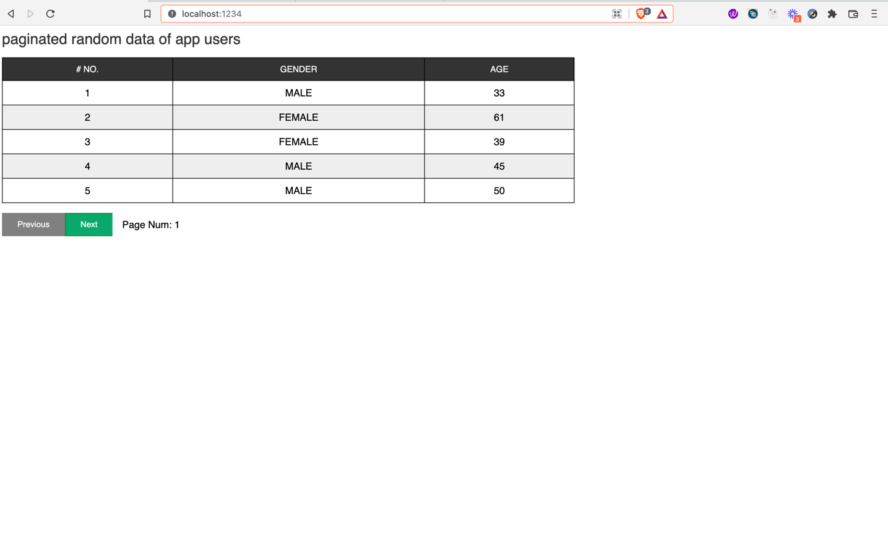

A simple vanilla JS frontend app that displays paginated data, fetched from a remote endpoint.

[See it live!](https://toyeeb-pipeline-submission.netlify.app)

---

### Tools used
- Html5
- Css3
- Typescript
- Parcel

### How does this work
- **Mounting/Initialisation**
- The app's entry point is in the app.ts file
- It calls the initApp function to initialise the app on the root element
- The initApp function and other implementations are in the users/index.ts file
- The idea behind mounting to a root element is to make this app re-usable in other applications.This mimics how React and other view libs/framework mount an app component to a page.
- **Pagination**
- The app uses the state of the 'currentPage' variable to decide what to render on the dom.
- currentPage is a proxy that runs an update whenever its value changes
- By default, the value is 0, on init of the app, the value is set to 1 
- The Previous button calls the goPrev function when its clicked.This function sets the currentPage to value -1
- The Next button calls the goNext function when its clicked.This function sets the currentPage to value +1
- To update the dom when the value of currentPage changes; the proxy calls the 'pageChangeOperations' function
- **What happens when page changes**
- pageChangeOperations() checks the fetchedUsers state to see if there is data for this page. If there is data, it passes this data to  'uiRenderer()' to display the data
- If there is no data, it fetches the data for the page via the endpoint, adds the returned data to the 'fetchedUsers' state, then performs the previous step once again (recursion)
- This means we don't have to fetch previously fetched data from the server since the data are stored as we fetch them.
- **How the UI is updated**
- The 'uiRenderer' function generates a template literal using the current state of the app and then sets the table rows to this new template
- The html syntax for table and rows are moved from the index.html page to the uiRenderer, to regenerate the rows whenever the state changes
- I used this method because it's faster than updating the node elements individually.
- 

